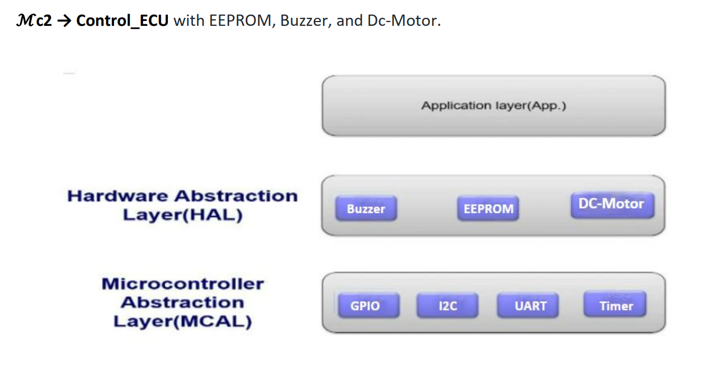

# The Code For This ECU is created on Eclipse IDE Version: 2023-03 (4.27.0) and build using avr-gcc Compiler
- **Contents:**
- Source Files in **'src'** Directory
- Header Files in **'include'** Directory
- output files after Compilation and linking stages in **'Debug'** Directory

 
