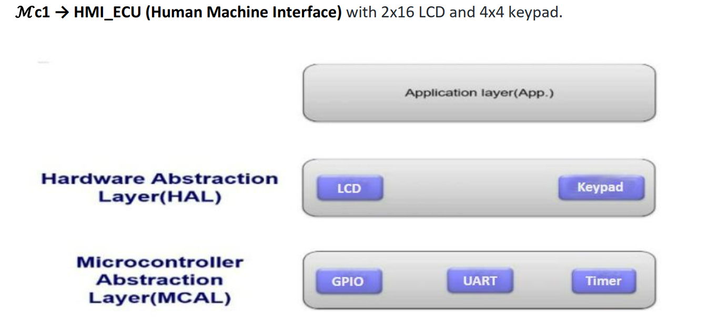

# WorkSpace for DOOR_LOCKER_SYSTEM include Two ECUs
- **HMI_ECU(Human Machine Interface):** is just responsible interaction with the user just take inputs through keypad and display
 messages on the LCD.
- **CONTROL_ECU:** is responsible for all the processing and decisions in the system like password
checking, open the door and activate the system alarm.

                                         
